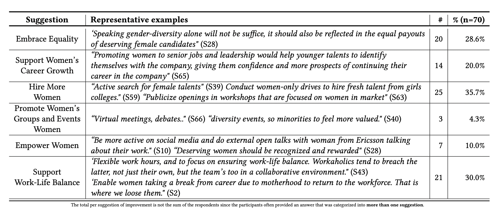

- A study on the challenges faced by women in software: https://arxiv.org/pdf/2203.10555
	- The study does not make it clear whether these are purely ideas the women have to address their problems or whether they are things they've seen work
	- Many of the suggestions either were or were coded in a way that abstracts them to a pretty lofty level, like "Empower women"
	- 
	-